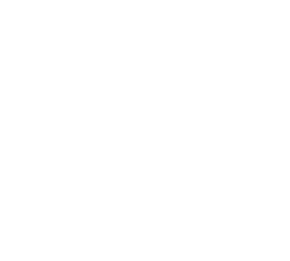

<!-- ████████████████████████████████████████████████████████████ -->
<!--                  BOOT SEQUENCE — ANIMATED HEADER              -->
<!-- ████████████████████████████████████████████████████████████ -->

<div align="center">

[](https://git.io/typing-svg)

<br>

<b><span style="color: #39FF14">[</span> NETWORK: ENCRYPTED <span style="color: #39FF14">]</span></b> &nbsp;&nbsp; <b><span style="color: #39FF14">[</span> STATUS: OVERDRIVE <span style="color: #39FF14">]</span></b> &nbsp;&nbsp; <b><span style="color: #39FF14">[</span> COFFEE: REFILLING <span style="color: #39FF14">]</span></b>

</div>

<br>


```bash
visitor@dev-os:~$ neofetch --profile /usr/bin/unstableblob
```

<div align="center">

<table border="0" align="center">
  <tr>
    <td align="center" width="280" style="background-color: #000000ff;">
      
    </td>
    <td align="left">
      <pre>
<b><span style="color: #39FF14">UnstableBlob</span></b>@<b><span style="color: #39FF14">dev-os</span></b>
-----------------------
<b><span style="color: #39FF14">OS</span></b>: dev-os
<b><span style="color: #39FF14">Admin</span></b>: Atharva Sheramkar
<b><span style="color: #39FF14">Kernel</span></b>: Ambition-X86_64
<b><span style="color: #39FF14">Uptime</span></b>: 20yrs (since boot)

<b><span style="color: #39FF14">Identity</span></b>: Full Stack Software Engineer
<b><span style="color: #39FF14">Speciality</span></b>: Scalable Web Architecture
<b><span style="color: #39FF14">Side Quest</span></b>: UI/UX & Graphic Design
<b><span style="color: #39FF14">Location</span></b>: Mumbai, Maharashtra, IN</pre>
    </td>
  </tr>
</table>

</div>

<br>

```bash
visitor@dev-os:~$ cat ./skills/core_tech.json
```

```json
{
  "frontend"        : ["React.js", "HTML5", "CSS3", "Tailwind CSS"],
  "backend"         : ["Node.js", "Express.js", "REST APIs"],
  "database"        : ["MongoDB", "Mongoose", "PostgreSQL"],
  "systems_core"    : ["C", "C++", "C#"],
  "creative_suite"  : ["Graphic Design", "UI/UX", "Poster Design", "Figma"],
  "toolchain"       : ["Git", "VS Code", "Postman"]
}
```

<br>

```bash
visitor@dev-os:~$ ls -la ~/experience/
```

```
total 3 entries

drwxr-xr-x  fundora-internship/          
│   └── Role   : Frontend Developer & Backend Integration
│   └── Impact : Built responsive UIs and intuitive user flows, integrated REST APIs end-to-end
│   └── Stack  : React · Node.js · Express · MongoDB
```

<br>


```bash
visitor@dev-os:~$ fetch --stats --live
```

```
Fetching live telemetry from GitHub API...  ✓ Connected
Rendering dashboard...
```

<div align="center">


</div>

<br>


<!-- ████████████████████████████████████████████████████████████ -->
<!--                     EASTER EGG SECTION                        -->
<!-- ████████████████████████████████████████████████████████████ -->

```bash
visitor@dev-os:~$ ls ./hidden/
```

```
WARNING: This directory contains classified recreational modules.
Proceed? [Y/n]: Y

drwxr-xr-x  games/
  └── currently_playing : Counter Strike · Minecraft · Indie-RPGs
  └── KD_ratio          : classified
  └── ping              : 300ms (Mumbai servers, not my fault)

drwxr-xr-x  playlists/
  └── coding_mode       : 90's hip hop + rnb 
  └── debug_mode        : aggressive edm only

drwxr-xr-x  fun_facts/
  └── [1] I once fixed a CSS bug at 3am and wept tears of joy.
  └── [2] My git commit messages are a cry for help AND documentation.
  └── [3] I believe padding: 0; margin: 0; is a lifestyle, not a reset.
```

<br>

<!-- ████████████████████████████████████████████████████████████ -->
<!--                 CONNECT — CONTACT PROTOCOLS                   -->
<!-- ████████████████████████████████████████████████████████████ -->

```bash
visitor@dev-os:~$ cat ./contact/protocols.conf
```

&nbsp;&nbsp;&nbsp;&nbsp;**# ── OPEN CHANNELS ─────────────────────────────────────────────**  
&nbsp;&nbsp;&nbsp;&nbsp;
&nbsp;&nbsp;&nbsp;&nbsp;[](https://linkedin.com/in/atharva-sheramkar-93a930351/)
&nbsp;&nbsp;&nbsp;&nbsp;[](https://github.com/unstableblob)
&nbsp;&nbsp;&nbsp;&nbsp;[](mailto:atharva20453@gmail.com)
&nbsp;&nbsp;&nbsp;&nbsp;[](https://unstableblob.github.io/pokemon_portfolio/)

&nbsp;&nbsp;&nbsp;&nbsp;**# ── RESPONSE SLA ──────────────────────────────────────────────**  
&nbsp;&nbsp;&nbsp;&nbsp;`Collaborative Projects`&nbsp;&nbsp;&nbsp;: < 24h  
&nbsp;&nbsp;&nbsp;&nbsp;`Freelance Inquiries`&nbsp;&nbsp;&nbsp;&nbsp;&nbsp;&nbsp;: < 48h  
&nbsp;&nbsp;&nbsp;&nbsp;`Random DMs about Vim`&nbsp;&nbsp;&nbsp;&nbsp;&nbsp;: whenever I feel brave

<br>

```bash
visitor@dev-os:~$ echo $MOTTO
```

```
"Ship fast. Design with intent. Debug with patience. Repeat."
```

```bash
visitor@dev-os:~$ █
```

<br>

<!-- ████████████████████████████████████████████████████████████ -->
<!--                        ACTIVITY GRAPH                         -->
<!-- ████████████████████████████████████████████████████████████ -->

<div align="center">


</div>

<br>

<!-- ████████████████████████████████████████████████████████████ -->
<!--                         FOOTER                                -->
<!-- ████████████████████████████████████████████████████████████ -->

<div align="center">

```
[ SESSION TERMINATED — CONNECTION CLOSED — SEE YOU IN THE COMMITS ]
```

</div>